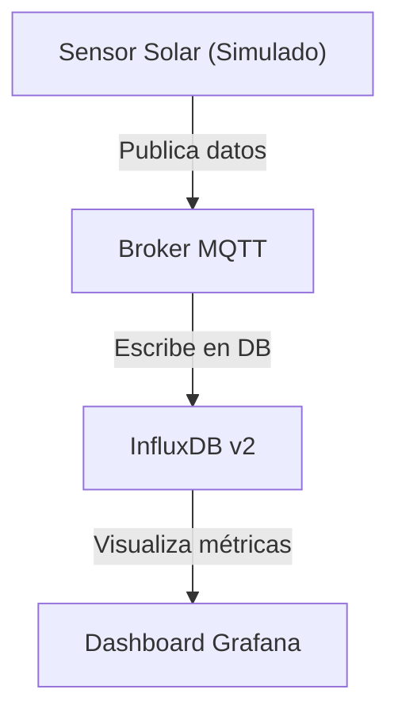

# 🏡 Monitoreo de Paneles Solares Residenciales

## 📦 Proyecto IoT – Unidad 2.4
**Autor:** Diego Huerta Espinoza 20212411
**Tecnologías:** Python, MQTT, InfluxDB v2, Grafana

---

### 🎯 Objetivo
Diseñar un sistema de monitoreo en tiempo real para paneles solares residenciales, simulando métricas como **voltaje, corriente, potencia generada y temperatura del panel**.  
El sistema permite visualizar estos datos mediante **dashboards interactivos**, facilitando el análisis energético y la detección de posibles fallos.

---

### 🧱 Arquitectura del Sistema


---

### ⚙️ Stack Tecnológico
- **Python:** Simulación de datos solares  
- **MQTT:** Comunicación entre sensor y servidor  
- **InfluxDB v2:** Almacenamiento de datos con timestamp  
- **Grafana:** Visualización de métricas en tiempo real  

---

### 🚀 Instalación y Ejecución

1. **Instalar dependencias**
   ```bash
   pip install paho-mqtt influxdb-client
   ```

2. **Configurar credenciales en `solar_monitor.py`**
   ```python
   INFLUX_URL = "http://localhost:8086"
   INFLUX_TOKEN = "TU_TOKEN_AQUI"
   INFLUX_ORG = "upnech"
   INFLUX_BUCKET = "iotdata"
   ```
  
  
3. **Codigo Completo**
    ```python
    import time
    import random
    import json
    import paho.mqtt.client as mqtt
    from influxdb_client import InfluxDBClient, Point
    from influxdb_client.client.write_api import SYNCHRONOUS
    
    # Configuración
    MQTT_BROKER = "localhost"
    MQTT_PORT = 1883
    MQTT_TOPIC = "solar/panel1"
    
    INFLUX_URL = "http://localhost:8086"
    INFLUX_TOKEN = "V4gVVj2vXWXWUBkcqezRfNgoZK2Rd8JgOQZVFku6MSV5BYIvDmXFhMPHZfZy9D_3SzZcb32WJPxjXUQTIcIf2g=="
    INFLUX_ORG = "upnech"
    INFLUX_BUCKET = "iotdata"
    
    # Conexión MQTT
    mqtt_client = mqtt.Client()
    mqtt_client.connect(MQTT_BROKER, MQTT_PORT, 60)
    
    # Conexión InfluxDB v2
    influx_client = InfluxDBClient(url=INFLUX_URL, token=INFLUX_TOKEN, org=INFLUX_ORG)
    write_api = influx_client.write_api(write_options=SYNCHRONOUS)
    
    # Publicación continua
    while True:
        voltaje = round(random.uniform(18.0, 22.0), 2)
        corriente = round(random.uniform(4.0, 6.0), 2)
        temperatura = round(random.uniform(25.0, 45.0), 2)
        potencia = round(voltaje * corriente, 2)
    
        payload = json.dumps({
            "voltaje": voltaje,
            "corriente": corriente,
            "potencia": potencia,
            "temperatura": temperatura
        })
    
        # MQTT
        mqtt_client.publish(MQTT_TOPIC, payload)
    
        # InfluxDB
        point = Point("panel_solar")\
            .tag("panel", "residencial")\
            .field("voltaje", voltaje)\
            .field("corriente", corriente)\
            .field("potencia", potencia)\
            .field("temperatura", temperatura)
    
        write_api.write(bucket=INFLUX_BUCKET, org=INFLUX_ORG, record=point)
    
        print("📡 Publicado:", payload)
        time.sleep(5)
       ```

3. **Ejecutar el simulador**
   ```bash
   python solar_monitor.py
   ```
   ---

### MQTT correctamente implementado


---
### influxdb correctamente implemenatdo


---


### 📊 Dashboards en Grafana

#### 🟩 Panel 1: Producción Energética
- **Métricas:** Voltaje, Corriente, Potencia  
- **Tipo:** Gráfico de líneas + barras  
- **Objetivo:** Evaluar rendimiento energético  


#### 🔥 Panel 2: Condiciones Térmicas
- **Métrica:** Temperatura del panel  
- **Tipo:** Gráfico de líneas  
- **Objetivo:** Analizar impacto térmico en eficiencia  


---

### 📈 Análisis de Datos

Durante la simulación, se observaron los siguientes rangos:

| Métrica | Mínimo | Máximo |
|----------|---------|---------|
| Voltaje (V) | 18.0 | 22.0 |
| Corriente (A) | 4.0 | 6.0 |
| Potencia (W) | 72.0 | 132.0 |
| Temperatura (°C) | 25.0 | 45.0 |

La potencia generada varía según la luz simulada, y la temperatura se mantiene dentro de rangos seguros para operación residencial.

---

### 🧪 Dataset Simulado

Los datos se generan en tiempo real usando `random.uniform(...)` y se publican cada **5 segundos**.  
El formato es **JSON**:

```json
{
  "voltaje": 20.5,
  "corriente": 5.2,
  "potencia": 106.6,
  "temperatura": 32.1
}
```
